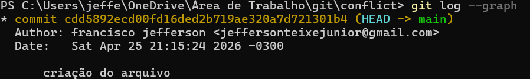
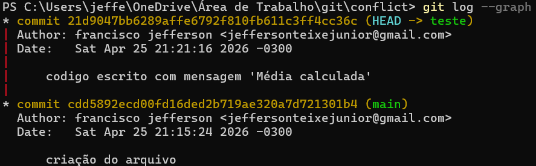
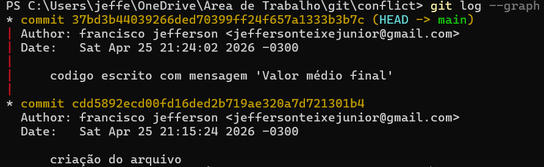
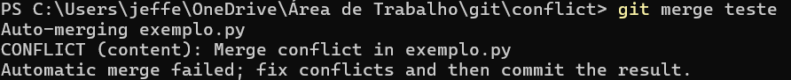
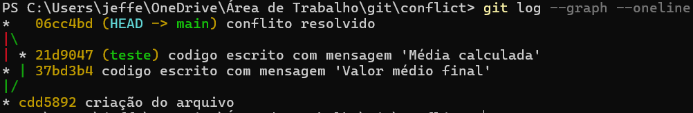

# Resolução de Conflitos
<!-- Este arquivo ensina como identificar, entender e resolver conflitos de merge no Git -->

## 📋 Objetivos de Aprendizagem

<!-- TODO: Objetivos sobre resolução de conflitos -->

## 🎯 Introdução

<!-- TODO: Conflitos são normais e esperados! -->
<!-- Não tenha medo - todo desenvolvedor lida com eles -->

### Mensagem Importante

<!-- TODO: Encorajar alunos -->
<!-- Conflitos não são erros - são oportunidades de aprendizado -->

## O que São Conflitos de Merge?
   Um conflito de merge ocorre quando o Git, apesar de sua inteligência algorítmica, encontra uma ambiguidade que não pode ser resolvida automaticamente. Isso acontece tipicamente quando duas ramificações (branches) distintas alteram a mesma linha de um arquivo de formas diferentes, ou quando uma branch deleta um arquivo que outra modificou. 

<!-- Quando Git não consegue resolver automaticamente -->
   Tecnicamente, o Git falha ao tentar aplicar um 'Three-way merge', pois as mudanças são divergentes a partir do ancestral comum, exigindo que a inteligência humana intervenha para decidir qual estado final preserva a integridade lógica do sistema.

### Por que Conflitos Acontecem?

<!-- TODO: Explicar causas -->

1. <!-- Duas pessoas editam a mesma linha -->
2. <!-- Mudanças em linhas próximas -->
3. <!-- Um deleta arquivo que outro modificou -->
4. <!-- Refatorações que afetam mesmo código -->

### Cenário Típico

<!-- TODO: Exemplo visual de como conflito surge -->

```
Pessoa A                     Pessoa B
   |                            |
   |---edita linha 10           |
   |                            |---edita linha 10
   |                            |
   |---commit                   |---commit
   |                            |
   |---push → main              |---push → CONFLITO!
```

## Identificando Conflitos

### Git Avisa

<!-- TODO: Mensagens que indicam conflito -->

```bash
# TODO: Exemplo de output quando há conflito
```

### Comandos para Verificar

```bash
# TODO: Como ver quais arquivos têm conflito
# git status
# git diff
```

## Anatomia de um Conflito

### Marcadores de Conflito

<!-- TODO: Explicar os marcadores -->

```
<<<<<<< HEAD
Seu código (versão atual)
=======
Código do outro branch
>>>>>>> nome-do-branch
```

### Entendendo Cada Parte

<!-- TODO: Explicar detalhadamente -->

- `<<<<<<< HEAD`: <!-- Início do seu código -->
- `=======`: <!-- Separador -->
- `>>>>>>> nome-do-branch`: <!-- Fim do código do outro branch -->

### Exemplo Completo
Observação: esse exemplo assume que a branch principal se chama "main".

Crie um repositório com `git init`.

Crie um arquivo exemplo.py (isso vai variar de acordo com o sistema operacional)

#### Primeiro commit

Crie o primeiro commit

```bash
git add .
git commit -m "criação do arquivo"
git log --graph
```
O resultado do `git log` deve ser dessa forma(mudando o autor):


#### Criando Commit em Outra Branch

Crie outra branch

```bash
git switch -c teste
git log --graph
```

Deve ter o mesmo commit que a main(ou master).

Insira o código em exemplo.py:

```python
def calcular_media(valores):
    total = 0
    for v in valores:
        total += v
    
    print("Processando valores...")
    media = total / len(valores)
    
    # Linha 10 (diferença aqui)
    resultado = f"Média calculada: {media}"
    
    return resultado


dados = [10, 20, 30]
print(calcular_media(dados))
```

Crie um novo commit:


```bash
git add .
git commit -m "codigo escrito com mensagem 'Média calculada'"
git log --graph
```



#### Criando o Segundo Commit em main

Volte para a main

```bash
git switch main
```

Troque o código de exemplo.py para esse (mesmo código com uma diferença na linha 10):

```python
def calcular_media(valores):
    total = 0
    for v in valores:
        total += v
    
    print("Processando valores...")
    media = total / len(valores)
    
    # Linha 10 (diferença aqui)
    resultado = f"Valor médio final: {media}"
    
    return resultado


dados = [10, 20, 30]
print(calcular_media(dados))
```

Crie um novo commit:

```bash
git add .
git commit -m "codigo escrito com mensagem 'Valor médio final'"
git log --graph
```



#### Fazendo o Merge e Resolvendo o Conflito

Tenha certeza de que está na main.

```bash
git switch main
git merge teste
```

Vai aparecer a mensagem de conflito:



e o arquivo terá na linha 10 onde houve conflito.

```python
<<<<<<< HEAD
    resultado = f"Média calculada: {media}"
=======
    resultado = f"Valor médio final: {media}"
>>>>>>> teste
```

troque para (não esquecendo a identação):

```python
    resultado = f"Média: {media}"
```

e faça um commit para resolver o conflito:

```bash
git add .
git commit -m "conflito resolvido"

git log --graph --oneline
```



Se tentar fazer um `git merge teste`, irá retornar "Already up to date".

## Resolvendo Conflitos Manualmente

### Passo a Passo

#### 1. Identificar Arquivos com Conflito

```bash
# TODO: git status mostra arquivos em conflito
```

#### 2. Abrir Arquivo no Editor

<!-- TODO: Escolher editor (VS Code, Sublime, etc.) -->

#### 3. Analisar as Versões

<!-- TODO: Entender AMBAS as mudanças -->

#### 4. Decidir o que Manter

<!-- TODO: Opções -->

- Manter apenas sua versão
- Manter apenas a versão do outro
- Combinar ambas as versões
- Escrever algo completamente novo

#### 5. Editar o Arquivo

<!-- TODO: Remover marcadores, deixar código final -->

```markdown
# Resolução: Combinar ambas as versões
## Introdução ao Git

Git é um sistema de controle de versão distribuído, criado em 2005,
e muito popular para versionamento de código.
```

#### 6. Remover TODOS os Marcadores

<!-- TODO: <<<<<<, =======, >>>>>>> devem ser deletados -->

#### 7. Testar

<!-- TODO: Verificar que o código/documento está correto -->

#### 8. Marcar como Resolvido

```bash
# TODO: git add para marcar resolução
# git add arquivo-resolvido.md
```

#### 9. Completar o Merge

```bash
# TODO: git commit para finalizar merge
# git commit -m "resolve: merge de feature X"
```

## Estratégias de Resolução

### Aceitar Completamente Uma Versão

#### Para priorizar a nossa versão em conflitos automáticos
```bash
# git merge -Xours nome-da-branch
```

#### Para priorizar a versão que está vindo de fora
```bash
# git merge -Xtheirs nome-da-branch
```
   Em cenários onde a escala de mudanças é massiva, a resolução manual linha a linha torna-se inviável. As estratégias de estratégia de recursão permitem automatizar essa decisão. A opção -Xours orienta o Git a favorecer sistematicamente a versão da branch atual (aquela em que você está), sendo ideal para proteger configurações locais ou códigos core que não podem ser alterados. Já a -Xtheirs prioriza a branch que está sendo integrada, sendo a escolha correta quando você está absorvendo uma 'hotfix' ou uma atualização crítica de terceiros que deve sobrescrever o estado atual.

```bash
# TODO: Usar theirs ou ours
# git checkout --ours arquivo.md
# git checkout --theirs arquivo.md
```


### Combinar Mudanças

<!-- TODO: Quando faz sentido mesclar -->

### Reescrever

<!-- TODO: Quando nenhuma versão está ideal -->

## Ferramentas de Merge

### Editor de Texto

   A resolução de conflitos via terminal em arquivos complexos (como códigos ou grandes datasets JSON) é propensa a erros. O uso do git difftool atua na fase de pré-análise, permitindo uma inspeção visual comparativa antes de qualquer alteração. Uma vez identificada a colisão, o git mergetool invoca uma interface gráfica (GUI) que segmenta o arquivo em três painéis: a base comum, a versão local e a versão remota. Essa visualização tripartida é fundamental para que o desenvolvedor possa compor uma solução híbrida que aproveite o melhor de ambas as versões.

### VS Code

O VS Code possui integração nativa com o Git e permite resolver conflitos sem sair do editor. Ao abrir um arquivo com conflito, ele exibe botões de ação acima de cada marcador:

- **Accept Current Change** — mantém o código da sua branch
- **Accept Incoming Change** — mantém o código da branch que está sendo mergeada
- **Accept Both Changes** — inclui as duas versões
- **Compare Changes** — abre um diff lado a lado

Para configurar o VS Code como sua ferramenta de merge padrão (mergetool), utilize os comandos abaixo. 
Essa configuração permite que, ao executar `git mergetool`, o Git abra automaticamente o VS Code para resolver os conflitos. 

> **Nota:** Para que esses comandos funcionem, o comando `code` deve estar configurado no seu terminal (no VS Code, use `Ctrl+Shift+P` e procure por "Shell Command: Install 'code' command in PATH").

```bash
git config --global merge.tool vscode
git config --global mergetool.vscode.cmd 'code --wait $MERGED'
```

### Ferramentas Visuais Externas

Quando os conflitos são numerosos ou envolvem código complexo, ferramentas visuais dedicadas oferecem uma interface de três painéis (sua versão / base comum / versão deles) que facilita muito a comparação.

#### Meld

Ferramenta open-source com interface simples, boa opção para quem está começando.

```bash
# Instalação no Ubuntu/Debian
sudo apt install meld

# Configuração no Git
git config --global merge.tool meld
```

#### KDiff3

Além da interface visual, o KDiff3 tenta mesclar automaticamente as partes que não têm conflito real, deixando para o usuário apenas o que precisa de decisão.

```bash
# Instalação no Ubuntu/Debian
sudo apt install kdiff3

# Configuração no Git
git config --global merge.tool kdiff3
```

#### P4Merge

Gratuito e disponível para Windows, macOS e Linux. Tem visual limpo e é bastante usado em ambientes profissionais.

> **Observação:** O caminho do executável do P4Merge pode variar dependendo do seu sistema operacional e local de instalação. Certifique-se de ajustar o caminho nas configurações do Git caso a ferramenta não seja encontrada automaticamente.

```bash
# Após instalar (https://www.perforce.com/products/helix-core-apps/merge-diff-tool-p4merge )
git config --global merge.tool p4merge
# Exemplo de ajuste de caminho (se necessário):
# git config --global mergetool.p4merge.path "/usr/local/bin/p4merge"


### git mergetool

#### O mergetool abre uma interface visual para resolver conflitos
```bash
git mergetool
```

#### O difftool permite comparar as versões antes de decidir
```bash
git difftool
```

### Workflow Completo com Mergetool

```bash
# 1. Merge gera conflito
git merge feature/nova-funcionalidade

# 2. Verifique os arquivos em conflito
git status

# 3. Abra a ferramenta configurada
git mergetool
# A ferramenta abre para cada arquivo em conflito, um por vez
# Resolva, salve e feche

# 4. Remova os arquivos .orig gerados (backup automático)
> **Cuidado:** O comando `git clean` apaga arquivos permanentemente. Use apenas se tiver certeza de que quer remover os backups `.orig`.
git clean -f *.orig

# 5. Adicione e finalize
git add arquivo-resolvido.py
git commit -m "merge: resolve conflito em arquivo-resolvido.py"
```

### Git Aliases para Setup Rápido

Adicione ao seu `~/.gitconfig` para trocar de ferramenta com um comando só:

```bash
git config --global alias.use-vscode '!git config --global merge.tool vscode && git config --global mergetool.vscode.cmd "code --wait $MERGED"'
git config --global alias.use-meld '!git config --global merge.tool meld'
git config --global alias.use-kdiff3 '!git config --global merge.tool kdiff3'
git config --global alias.mt 'mergetool'
```

Uso:

```bash
git use-meld    # troca para Meld
git mt          # abre o mergetool nos arquivos com conflito
```

### Comparativo das Ferramentas

| Ferramenta | Plataforma | Custo | Destaques |
|---|---|---|---|
| **VS Code** | Linux, Windows, macOS | Gratuito | Integrado ao editor, sem instalação extra |
| **Meld** | Linux, Windows, macOS | Gratuito / Open-source | Interface simples, ótimo para iniciantes |
| **KDiff3** | Linux, Windows, macOS | Gratuito / Open-source | Auto-merge de partes não conflitantes |
| **P4Merge** | Linux, Windows, macOS | Gratuito (proprietário) | Visual limpo, popular em equipes profissionais |

### Quando usar ferramenta em vez de resolver manualmente?

A edição direta do arquivo com os marcadores `<<<<<<<`, `=======`, `>>>>>>>` funciona bem para conflitos simples. Prefira uma ferramenta visual quando:

- O arquivo tem mais de dois ou três blocos de conflito
- O conflito envolve código que foi movido (refatoração), não apenas modificado
- Você precisa ver o estado **antes das duas branches divergirem** (painel base)
- A leitura dos marcadores dificulta entender o contexto ao redor

### Git GUI Tools

#### GitKraken

<!-- TODO: Interface de merge do GitKraken -->

#### SourceTree

<!-- TODO: Interface de merge do SourceTree -->

### Configurando Merge Tool

```bash
# TODO: Configurar ferramenta padrão
# git config --global merge.tool vimdiff
# git config --global merge.tool meld
```

## Tipos de Conflitos

### Conflito de Conteúdo

<!-- TODO: Mais comum - mesmas linhas editadas -->

### Conflito de Renomeação

<!-- TODO: Arquivo renomeado em branches diferentes -->

### Conflito de Deleção

<!-- TODO: Um deleta, outro modifica -->

### Conflito de Estrutura

<!-- TODO: Mudanças em estrutura de pastas -->

## Prevenindo Conflitos

Embora ferramentas ajudem a resolver, a melhor prática é a prevenção através de fluxos de trabalho inteligentes. Commits pequenos e atômicos, aliados a Pull/Fetch frequentes, garantem que a divergência entre a sua branch e a main seja mínima. Em sistemas de missão crítica, como os desenvolvidos em eletrônica aeroespacial, a fragmentação de tarefas em arquivos distintos e o uso de interfaces bem definidas são as defesas primárias contra colisões de código massivas.

### Comunicação

<!-- TODO: Avisar equipe sobre mudanças grandes -->

### Pull/Fetch Frequente

<!-- TODO: Manter branch atualizada -->

```bash
# TODO: Atualizar frequentemente
# git fetch origin
# git merge origin/main
```

### Commits Pequenos e Frequentes

<!-- TODO: Menos mudanças = menos conflitos -->

### Dividir Trabalho

<!-- TODO: Trabalhar em partes diferentes do código -->

### Feature Flags

<!-- TODO: Evitar branches de longa duração -->

## Resolvendo Conflitos em Pull Requests

### Conflitos no GitHub

<!-- TODO: GitHub mostra conflitos em PRs -->

### Método 1: Resolver Localmente

```bash
# TODO: Passos para resolver localmente
# 1. git fetch upstream
# 2. git merge upstream/main
# 3. Resolver conflitos
# 4. git push
```

### Método 2: GitHub Interface

<!-- TODO: Resolver na interface web (se simples) -->

### Atualizar Branch com Main

```bash
# TODO: Manter PR atualizado
```

## Abortando um Merge

A resolução de conflitos pode se tornar excessivamente complexa se houver muitos arquivos alterados simultaneamente. Nestes casos, o comando git merge --abort funciona como um 'botão de pânico'. Ele interrompe o processo de integração e restaura o repositório ao estado exato em que estava antes do comando de merge ser disparado. É uma prática recomendada usar o abort sempre que houver dúvida sobre a integridade da resolução manual, permitindo ao desenvolvedor reavaliar a estratégia de integração sem deixar o repositório em um estado 'sujo' ou quebrado.

### Retorna ao estado anterior caso o merge esteja muito complexo
```bash
# TODO: git merge --abort
```

### Quando Abortar

<!-- TODO: Se você  fez algo errado ou quer recomeçar -->

### Como Abortar

```bash
# TODO: git merge --abort
```

### Efeito

<!-- TODO: Volta ao estado anterior ao merge -->

## Troubleshooting de Conflitos

### Problemas Comuns

<!-- TODO: Conflitos inesperados durante merge ou rebase -->

Quando um conflito parece aparecer sem motivo, vale revisar se a branch local está desatualizada ou se o merge anterior foi interrompido no meio.

### Reiniciar o Merge

```bash
git merge --abort
```

Use esse comando quando quiser cancelar o merge atual e voltar ao estado anterior para tentar novamente com mais calma.

### Desfazer o Merge

```bash
git reset --merge HEAD~1
```

Esse caminho é útil quando você quer desfazer o merge e voltar um passo, mantendo apenas o necessário para recomeçar.

### Merge Corrompido

<!-- TODO: Quando o merge ficou em estado inconsistente -->

Se o merge ficar corrompido ou travado, a abordagem mais segura costuma ser abortar, revisar o histórico e tentar o processo novamente depois de atualizar a branch.

### Ferramentas de Ajuda

```bash
git mergetool
git merge --continue
```

O `git mergetool` ajuda a visualizar e resolver conflitos com uma ferramenta externa. Depois de corrigir os arquivos, `git merge --continue` finaliza o merge.

### Quando Pedir Ajuda

<!-- TODO: Avisar o time quando a resolução não estiver clara -->

Se a origem do conflito não estiver clara, comunique o time antes de forçar uma solução. É melhor alinhar a intenção do que aplicar uma correção que esconda um problema maior.

### Logs para Debug

```bash
git status
git log --oneline --graph --decorate -n 20
git diff
```

Esses comandos ajudam a entender o que mudou, onde o conflito começou e qual foi o último estado válido da branch.

## Conflitos Complexos

### Múltiplos Arquivos

<!-- TODO: Resolver um por vez -->

### Conflitos Grandes

<!-- TODO: Estratégias para muitos conflitos -->

### Quando Pedir Ajuda

<!-- TODO: Não tenha medo de pedir ajuda -->
<!-- Professor, colegas, issue no projeto -->

## Exemplos Práticos

### Exemplo 1: Conflito Simples

<!-- TODO: Demonstração passo a passo -->

```
Cenário:
- Você edita README linha 5
- Colega edita README linha 5
- Colega faz merge primeiro
- Você tenta merge → conflito
```

<!-- TODO: Resolução completa -->

### Exemplo 2: Conflito em Múltiplos Arquivos

<!-- TODO: Como organizar a resolução -->

### Exemplo 3: Conflito de Código

<!-- TODO: Exemplo com código (não apenas docs) -->

## Dicas e Truques

### Usar Git Log para Contexto

```bash
# TODO: Ver histórico para entender mudanças
# git log --oneline --graph
```

### Git Diff para Ver Mudanças

```bash
# TODO: Comparar versões
```

### Git Blame para Rastrear

```bash
# TODO: Ver quem mudou o quê
# git blame arquivo.md
```

### Comunicar com o Autor

#### Use o git blame para identificar quem editou a linha e converse com o autor para entender a intenção do código original.

   A resolução técnica de um conflito é apenas metade do trabalho. A outra metade é política/social. O comando git blame deve ser usado como uma ferramenta de rastreabilidade para identificar o autor da mudança divergente. Antes de concluir o merge, uma breve consulta ao autor evita a deleção de lógicas intencionais (edge cases) que podem não ser óbvias à primeira vista.

<!-- TODO: Perguntar intenção das mudanças -->

## Fluxo de Trabalho Anti-Conflito

<!-- TODO: Workflow que minimiza conflitos -->

1. <!-- Fetch regularmente -->
2. <!-- Merge main na sua branch frequentemente -->
3. <!-- PRs pequenos -->
4. <!-- Comunicação -->
5. <!-- Feature flags -->

## Erros Comuns

### Erro 1: Não Remover Marcadores

<!-- TODO: Deixar <<<<< no código -->

### Erro 2: Marcar como Resolvido Sem Testar

<!-- TODO: Resolver mas código quebrado -->

### Erro 3: Aceitar Mudanças Sem Entender

<!-- TODO: Importância de entender AMBAS as versões -->

### Erro 4: Fazer Force Push

<!-- TODO: Perigo em branches compartilhadas -->

## Conflitos em Diferentes Arquivos

### Markdown

<!-- TODO: Conflitos em documentação -->

### Código

<!-- TODO: Conflitos em código fonte -->

### JSON/YAML

<!-- TODO: Arquivos de configuração -->

### Binários

<!-- TODO: Imagens, PDFs - escolher uma versão -->

## Exercícios

<!-- TODO: Exercícios práticos com conflitos -->

1. <!-- Criar conflito intencional e resolver -->
2. <!-- Resolver conflito simulado -->
3. <!-- Usar mergetool -->
4. <!-- Resolver conflito em PR -->

## Checklist de Resolução

<!-- TODO: Passo a passo para sempre seguir -->

- [ ] Identificar arquivos em conflito
- [ ] Entender ambas as versões
- [ ] Decidir abordagem
- [ ] Editar arquivo
- [ ] Remover marcadores
- [ ] Testar mudanças
- [ ] git add
- [ ] git commit
- [ ] Verificar que tudo funciona

## Recursos Adicionais

<!-- TODO: Links sobre resolução de conflitos -->

- [Git Merge Conflicts](https://git-scm.com/docs/git-merge#_how_conflicts_are_presented)
- [GitHub Resolving Conflicts](https://docs.github.com/en/pull-requests/collaborating-with-pull-requests/addressing-merge-conflicts)
- <!-- Mais recursos -->

## Resumo

<!-- TODO: Pontos principais sobre resolução de conflitos -->

### Lembre-se

- Conflitos são normais
- Não tenha medo
- Entenda ambas as versões
- Teste antes de finalizar
- Peça ajuda se precisar

---

## 👥 Contribuidores

<!-- Este conteúdo é colaborativo. Contribuidores deste arquivo: -->
<!-- Adicione seu nome quando contribuir: Filipe Alves de Sousa
- [@seu-usuario](https://github.com/filipe19) - Estratégias e Ferramentas de Resolução (#46)
-->
<!-- Este conteúdo é colaborativo. Contribuidores deste arquivo: -->
<!-- Adicione seu nome quando contribuir: Kaique Pinheiro 
[@AtlasExploit](https://github.com/AtlasExploit) - Ferramentas de Merge: VS Code, Meld, KDiff3, P4Merge, aliases e workflow (#47) -->
